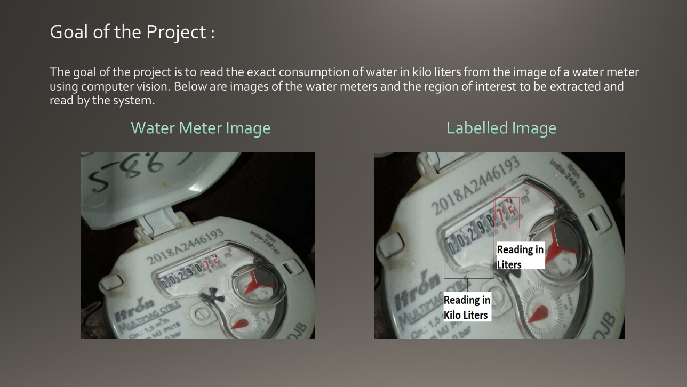
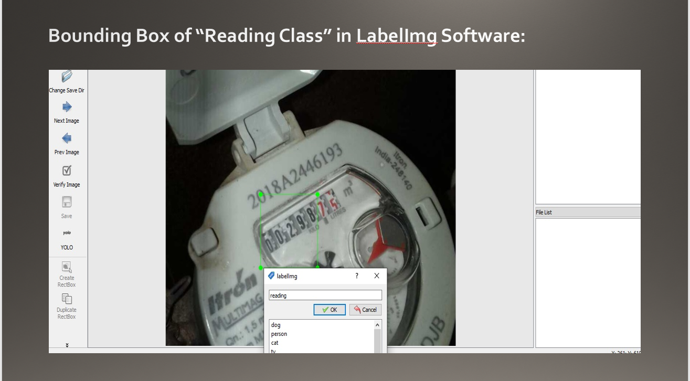
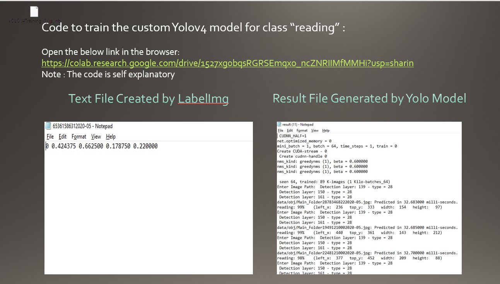
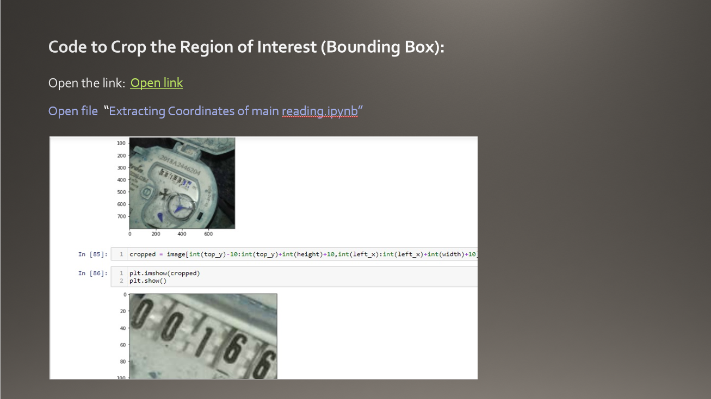
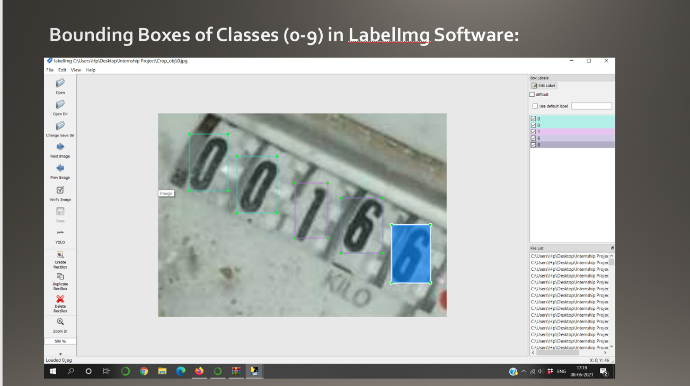
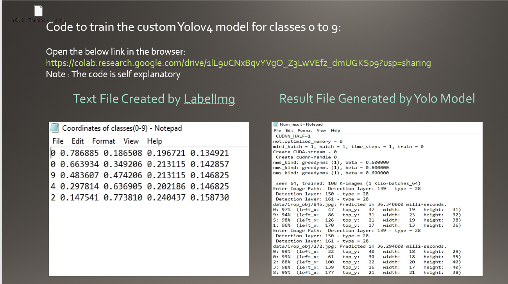
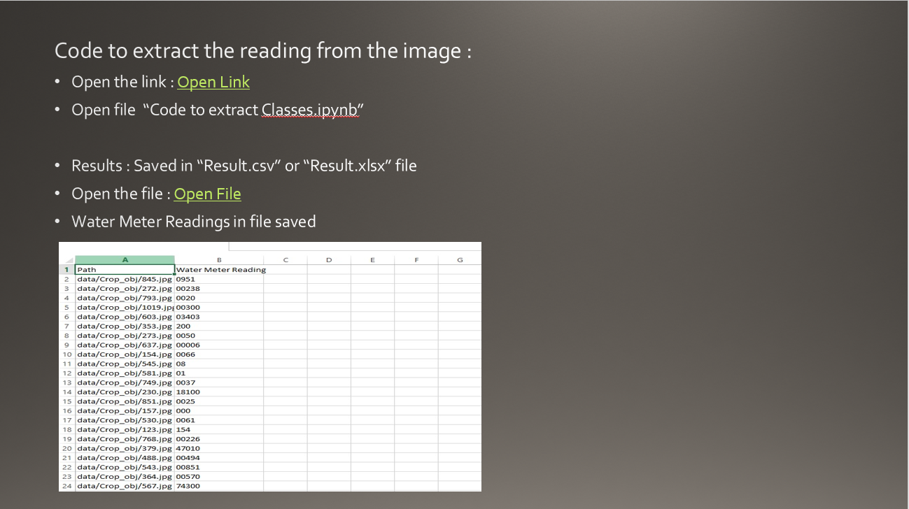

# AUTOMATIC-WATER-METER-IMAGE-READING-USING-DEEP-LEARNING
The process of traditional water meter reading involves the deployment of trained personnel by the organization to survey every single house and other properties in their list to note down consumption metrics. This data is later aggregated manually and bills are prepared to be sent to the respective consumers for further perusal. A handful of limitations and potential drawbacks to this existing process have a direct impact on cost borne by the organization and level of inconvenience experienced by the consumer. Now the newer technologies in the domain of Computer Vision can be leveraged to make the process cost-effective and streamlined.
# Models used
1) YOLOv4

